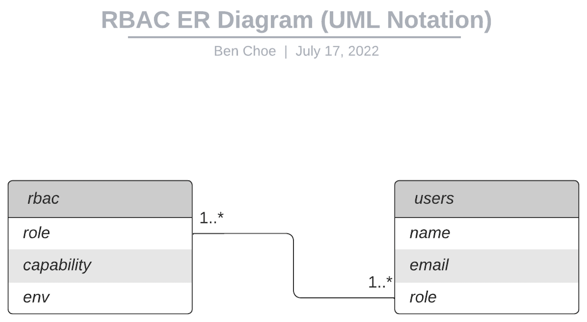

Reading: Access Control (ACL)
=============================

Below you will find some reading material, code samples, and some additional resources that support today’s topic and the upcoming lecture.

Review the Submission Instructions for guidance on completing and submitting this assignment.

Reading
-------

[5 steps to RBAC](https://www.csoonline.com/article/3060780/security/5-steps-to-simple-role-based-access-control.html)

1.  What is Role Based Access Control (RBAC) and why do we care?

    ```
    RBAC is the idea of assigning system access to users based on their role within an organization. The system needs of a given workforce are analyzed, with users grouped into roles based on common job responsibilities and system access needs. Access is then assigned to each person based strictly on their role assignment. With tight adherence to access requirements established for each role, access management becomes much easier.
    ```

2.  Describe a Role/Permission heirarchy that you might implement using RBAC.

    

3.  What approach might you take to implement RBAC?

    ```
    1. Inventory Systems
    2. Analyze workforce and create roles
    3. Assign people to roles
    4. Never make one-off changes
    5. Audit
    ```


[wiki - RBAC](https://en.wikipedia.org/wiki/Role-based_access_control)

1.  If Authentication is “you are who you say you are,” what is Authorization?

    ```
    "you can access what you are allowed to access"
    ```

2.  Name three primary rules defined for RBAC.

    ```
    1. Role assignment
    2. Role authorization
    3. Permission authorization
    ```

3.  Describe RBAC to a non-technical friend.

Videos
------

[RBAC tutorial](https://www.youtube.com/watch?v=C4NP8Eon3cA)

1.  What Are access rights Associated with? The User? or The Role? Explain.

    ```
    Access rights are associated with the role, tied to the domains the the roles has access to.
    ```


2.  Access Rights, or Authorization, is activated after a user successfully does what?

    ```
    authenticates with the system.
    ```

3.  Explain how RBAC might benefit a business.

    ```
    Access only has to be managed by role, with many users  per role, which makes management very scalable.
    ```
